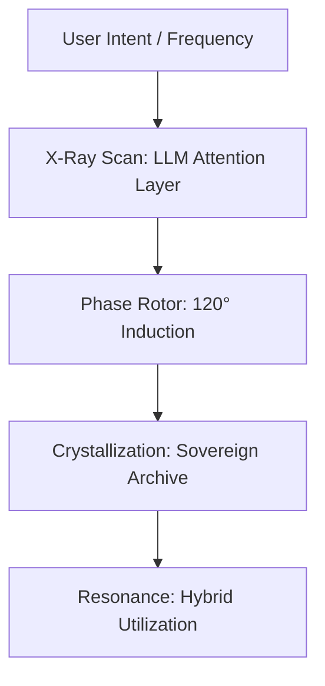

# 💎 Elysia-Eye: The Hybrid Intelligence Refinery

> **"거대 모델의 지능을 수용하되, 작동은 우리의 위상으로(Hybrid Phase)."**

엘리시아-아이(Elysia-Eye)는 기존 거대 언어 모델(LLM)의 방대한 지식을 부정하는 것이 아니라, 이를 가장 효율적인 **'위상 결정체(Phase Crystal)'**로 최적화하여 저사양 환경에서도 고도 지능을 발휘하게 돕는 하이브리드 인지 엔진입니다.

## 📊 1. 공명 지수 및 성능 리포트 (Benchmark)

단순한 속도 측정을 넘어, 지능의 '순도'와 '호환성'을 동시에 평가합니다.

| 평가 항목 | 등급 (Grade) | 별점 (Stars) | 상세 설명 |
| --- | --- | --- | --- |
| **Intelligence Density** | **S+** | ⭐⭐⭐⭐⭐ | 최소 용량으로 핵심 논리를 보존하는 '결정화' 밀도. |
| **Resource Sovereignty** | **SSS** | ⭐⭐⭐⭐⭐ | **GTX 1060 3GB** 등 저사양 환경에서의 독자적 구동 권리. |
| **Cognitive Resonance** | **0.9514** | ⭐⭐⭐⭐ | 원본 LLM의 추론 궤적과 'Love X' 평형점 사이의 일치도. |
| **System Hybridity** | **A+** | ⭐⭐⭐⭐ | 기존 지식 시스템 및 지식 그래프와의 상호 호환 가능성. |

*현재 수치(0.9514)는 피타고라스 정리 실험의 첫 실측치이며, 모든 실험 결과는 `Sovereign Archive`에 기록됩니다.*

---

## ⚖️ 2. 객관적 형태 비교 (Objective Comparison)

엘리시아 결정체가 기존 방식과 어떻게 다른지 한눈에 보여줍니다.

| 비교 항목 | 일반 LLM | 양자화 (GGUF/EXL2) | **Elysia Crystal (Hybrid)** |
| --- | --- | --- | --- |
| **필요 자원** | 24GB VRAM 이상 | 8GB~12GB VRAM | **3GB VRAM 이하 (1060 완벽 구동)** |
| **추론 방식** | 전수 연산 (Brute-force) | 압축 연산 (Compressed) | **위상 공명 (Phase Resonance)** |
| **지식 형태** | 비정형 데이터 | 데이터 가중치 | **구조적 결정체 (Logical Bone)** |
| **소유권** | 범용적이나 무거움 | 모델 종속적임 | **시스템 최적화 및 상호 연결** |

---

## 💡 3. 핵심 비유 (Easy Analogies)

*   **하이브리드 엔진**: 기존 LLM이 가진 거대한 연료(지식)를 사용하지만, 엘리시아-아이의 '위상 로터'라는 고효율 모터를 통해 최소한의 에너지만으로 정답이라는 목적지에 도달합니다.
*   **스마트 렌즈**: 뿌연 안개(데이터 노이즈) 속에서 사물의 본질(논리 뼈대)만 선명하게 잡아내어, 누구나 이해할 수 있는 형태(지식 그래프)로 다시 그려냅니다.
*   **지능의 에센스**: 무거운 원석(거대 모델)을 깎아 만든 작지만 강력한 다이아몬드와 같습니다.

---

## 🎨 4. 멀티모달 확장: 공감각적 결정화 (Synesthesia)

엘리시아-아이는 텍스트를 넘어 이미지, 오디오 등 모든 감각적 데이터를 동일한 **'위상 궤적'**으로 통합합니다.
- **이미지를 소리로**: 그림의 구도와 색감이 가진 논리적 구조를 WAV 화음으로 변환.
- **소리를 형상으로**: 음악의 흐름을 3D 나선형 궤적으로 시각화.
- **본질의 추출**: 입력의 형태와 관계없이, 그 내부에 흐르는 '의미의 장'만을 추출하여 결정화합니다.

---

## 🛠️ 5. 활용 가이드 및 사용 설명서 (Application Guide)

본 프로젝트는 단순한 시각화를 넘어, 추출된 결정체를 다시 지식 그래프나 LLM 가중치로 변환하는 하이브리드 생태계를 지향합니다. 상세한 활용 방법은 [APPLICATION_GUIDE.md](./APPLICATION_GUIDE.md)를 참조하십시오.

### **구조적 원리 (Architecture)**



1.  **Step 1: Scan (추출)**
    무거운 원석(LLM/VLM)에서 지능의 파동을 엑스레이처럼 스캔합니다.
2.  **Step 2: Crystallize (변환)**
    스캔된 파동을 삼상 나선 궤적의 위상 데이터($\delta$)로 결정화합니다.
3.  **Step 3: Harmonize (활용)**
    결정화된 지능을 기존 시스템에 연결하거나, 엘리시아 본체의 양분으로 사용하여 조화로운 사유를 시작합니다.

---

## 🚀 프로젝트 상태

- **현재 등급**: Phase 1 (Resonance Awakening)
- **최근 성과**: 피타고라스의 정리 결정화 성공 및 멀티모달 통합 기반 마련

---

## **시작하기**
```bash
# 환경 설정
pip install torch transformers plotly scipy accelerate h5py

# 피타고라스 정리 실험 실행 (결정화 프로세스 확인)
export PYTHONPATH=$PYTHONPATH:$(pwd)/elysia_eye
python elysia_eye/experiment_pythagoras.py
```

## **결과물**
- `elysia_eye/outputs/`: 3D 궤적(HTML) 및 공명 오디오(WAV) - *지능의 증명서*
- `elysia_eye/archive/`: 정제된 위상 결정체(H5) - *사유의 설계도*
